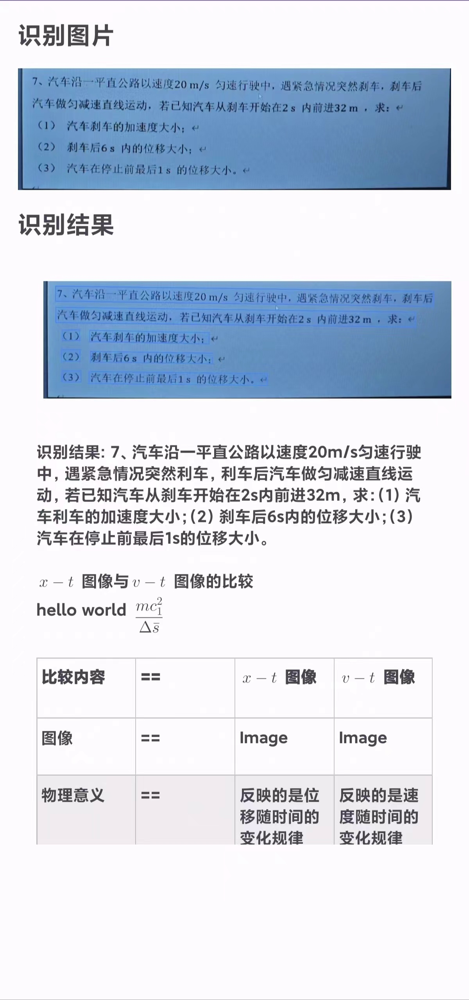

# 基于PaddleOCR的拍照裁剪&文本识别的android-demo

<!-- [Read in English](README_en.md) -->
## 项目简介

### 摘要

PaddleOCR 因其开源、高效以及卓越的识别效果，广泛应用于各种 OCR（Optical Character Recognition）场景。同时，PaddleOCR-Lite 凭借其轻量化和小巧的优势，成为移动端 OCR 识别的理想选择。

**然而，对于初学者而言，官方文档在模型的移动端部署的说明较为分散且复杂，主要集中在演示（demo）和模型开源上。此外，Paddle官方建议在官方演示基础上进行修改，而不是作为一个独立模块直接引入现有项目中，这使得将 PaddleOCR 直接应用于现有的安卓项目中变得更加困难。**

为了降低这一难度，本项目参考了 [PaddleOCR](https://github.com/PaddlePaddle/PaddleOCR)和[Paddle-lite-demo](https://github.com/PaddlePaddle/Paddle-Lite-Demo) 中的示例，对各文件进行了详细解释，帮助用户将 PaddleOCR 模块无缝集成到已有项目中。总之，以下是本项目的特点所在:

* **集成 PaddleOCR 文本识别模型:** 项目使用了 PaddleOCR 的文本识别模型，并结合 Android-Image-Cropper 库，实现了PaddleOCR在 Android 端的部署和高效的文本识别功能。

* **简化的部署过程:** 通过提供清晰的文件说明和代码示例，本项目帮助开发者轻松将 PaddleOCR 作为较为独立的模块部署到现有的 Android 项目中。

* **支持服务器端部署:** 除了移动端的实现外，项目还包含在服务器端使用 Python 版本的 PaddleOCR 模型的代码，为未来的服务器端功能扩展和交互提供了便利。

### 效果展示

| Initialization      | Selection       |
| ---------------     | --------------- |
|  |  |

| Cropping            | Result          |
| ---------------     | --------------- |
|  |  |

### 参考链接

> 参考[PaddleOCR](https://github.com/PaddlePaddle/PaddleOCR), demo位于`deploy/android-demo`下
>
> 参考[Paddle-lite-demo](https://github.com/PaddlePaddle/Paddle-Lite-Demo), demo位于`ocr/android`中

## PaddleOCR的导入和配置

本项目使用[PaddleOCR](https://github.com/PaddlePaddle/PaddleOCR)和[Paddle-lite-demo](https://github.com/PaddlePaddle/Paddle-Lite-Demo)两个demo中的部分代码完成移动端的PaddleOCR部署和文本的识别功能。

* ### 额外添加的项目文件

  * **OpenCV与PaddleLite:** PaddeleLite预测库，可以使用[PaddleOCR](https://github.com/PaddlePaddle/PaddleOCR)和[Paddle-lite-demo](https://github.com/PaddlePaddle/Paddle-Lite-Demo)两个demo的build.gradle进行下载，下载链接在文件的"def archives ="中。需要注意的是，两个项目的PaddleLite文件夹内容略有不同，本项目使用的是[PaddleOCR](https://github.com/PaddlePaddle/PaddleOCR)中下载得到的PaddleLite。
  * **assets:** 模型和标签存放位置。
    * 该文件夹主要包含models、labels两个文件夹和config.txt文件，本项目的assets文件夹中内容从[Paddle-lite-demo](https://github.com/PaddlePaddle/Paddle-Lite-Demo)中复制得到。
    * models: 存储模型，包含了分类模型的nb文件(cls)，检测模型的nb文件(det)，识别模型的nb文件(rec)。经过验证，发现Paddle-lite-demo中使用的模型效果好于PaddleOCR。
    * labels：存储标签，本项目使用的是中文+英文字母+数字的标签文件，其余标签文件可以在PaddleOCR仓库下载: <https://github.com/PaddlePaddle/PaddleOCR/tree/release/2.3/ppocr/utils。>
  * **cpp:** c++预测代码。由于[Paddle-lite-demo](https://github.com/PaddlePaddle/Paddle-Lite-Demo)中只有预测，没有文本识别的c++代码，因而本项目使用[PaddleOCR](https://github.com/PaddlePaddle/PaddleOCR)中的cpp文件。
  * **java:** android端应用实现代码。`ApiService.java`、`MainActivity.java`和`ResultActivity.java`实现了android端的应用功能。此外，由于是将PaddleOCR导入已有项目，因此只从[PaddleOCR](https://github.com/PaddlePaddle/PaddleOCR)复制了剩下的五个java文件用于文本的检测和识别。
  * **python:** 使用服务器端的PaddleOCR进行识别的python代码。

* ### 文件拷贝与修改

依照上述额外添加的项目文件描述，本项目在[PaddleOCR](https://github.com/PaddlePaddle/PaddleOCR)中下载和复制了OpenCV文件夹、PaddleLite文件夹、cpp文件夹和java中除`ApiService.java`、`MainActivity.java`和`ResultActivity.java`的文件; 在[Paddle-lite-demo](https://github.com/PaddlePaddle/Paddle-Lite-Demo)中下载了`assets`文件夹。

**cpp文件修改:** 由于android端通过JNI实现调用cpp文件，从而完成文本检测和识别，因此，对 cpp 文件夹中`native.cpp`需要将各函数修改成本项目的名称，从而与`OCRPredictorNative.java`中函数相对应。

``` c++
extern "C" JNIEXPORT jlong JNICALL
Java_com_example_questionextractionmodule_OCRPredictorNative_init{***}
```

**模型名称修改:** 模型名称位于`Predictor.java`中第90行，分别将检测、分类和识别模型的名称换成`assets/models`下模型的名称。

* ### ResultActivity.java修改

  * `loadModelAndRunInference`函数实现了模型初始化，其中需要传入模型路径、标签路径等参数，这个在`ResultActivity.java`中的全局变量里进行修改。
  * `runModel`函数实现了对模型调用完成文本检测和识别。其中`outputImage`是带有检测框的识别图片，`resultText`是识别后的完整输出，包含了坐标、分类结果、识别文本等，`res`则使用正则化过滤，只包含识别文本。
  * `onRunModel()`函数中可以修改要调用的模型从而完成相应的功能。

## Cropper库的安装与实现

本项目使用[Android-Image-Cropper库](https://github.com/CanHub/Android-Image-Cropper)，并使用方法三进行图片裁剪。由于Android-Image-Cropper的文档也没有给出详细的实现方案，因此在下面罗列几个比较重要但简便的实现方法完成图片裁剪。

* ### xml文件修改

在`AndroidManifest.xml`文件中添加`CropImageActivity`

``` xml
<activity
    android:name="com.canhub.cropper.CropImageActivity"
    android:theme="@style/Base.Theme.AppCompat"
/>
```

* ### build.gradle.kts修改

``` kotlin
dependencies {
    implementation("com.vanniktech:android-image-cropper:4.6.0")
}
```

* ### MainActivity.java修改

在`MainActivity.java`中添加`startCrop`函数后，对其调用即可完成对图片的裁剪。

``` java
private void startCrop(Uri uri) {
    cropImage.launch(new CropImageContractOptions(uri, new CropImageOptions()));
}
```

## 附加：服务器端使用python模型

在`ResultActivity.java`中，项目实现了在android端调用服务器端的python模型，其功能体现在`UploadImageTask`和`onPostExecute`两个函数中。在使用中需要修改`onPostExecute`函数中的服务器URL，并将`onCreate`函数中第87行`// new UploadImageTask().execute(croppedImageUri);`进行解注释。

在 python 文件夹使用flask实现服务器端程序，并调用`model.py`实现文本识别。
